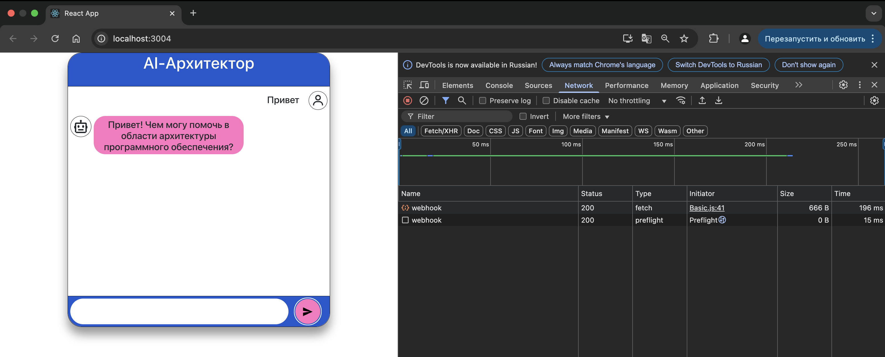
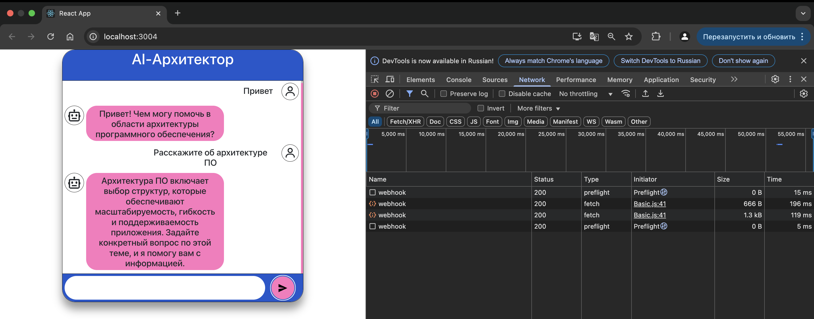

# Интеграция интеллектуального ассистента в веб-приложение

## Запуск UI-приложения
```bash
npm run start
```
Примечание: в начале запускаем RASA ассистента, потом UI-приложение.

## Запуск RASA ассистента
```bash
rasa run --cors "*" --enable-api --log-file rasa_debug.log -vv
```

### Скриншоты работающего приложения



### Лог работы RASA ассистента:
[rasa_debug.log](rasa_debug.log)
